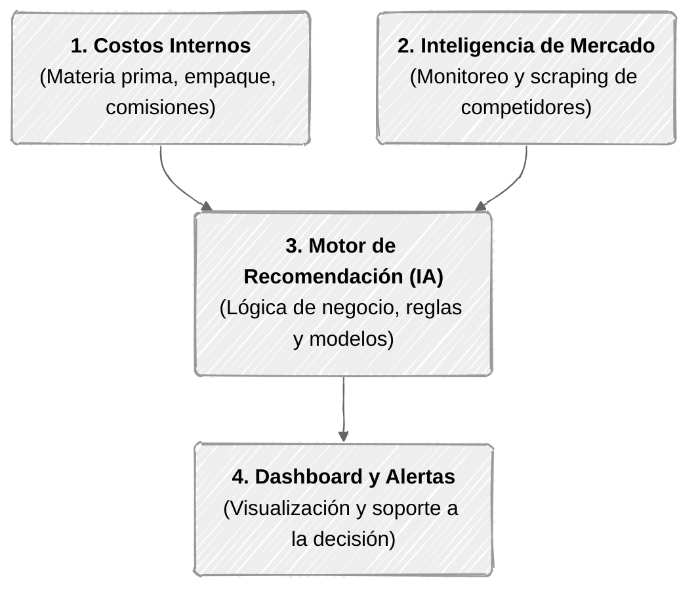

# Pricelytics

**Pricelytics** es una plataforma inteligente orientada al análisis y optimización de precios para vendedores y negocios que comercializan productos en canales digitales.

---

## 📌 Descripción

Establecer el precio adecuado para un producto representa uno de los mayores desafíos para el comercio digital. Factores como los costos reales de producción, comisiones de plataformas, precios de la competencia y la dinámica del mercado influyen directamente en la rentabilidad de un negocio.

**Pricelytics** centraliza y procesa estos factores para transformar datos dispersos en recomendaciones estratégicas, permitiendo a los vendedores tomar decisiones informadas para maximizar sus márgenes sin perder competitividad.

---

## 🎯 Objetivo

Desarrollar una plataforma que permita a los vendedores digitales **analizar el comportamiento de precios del mercado y tomar decisiones estratégicas basadas en datos**, equilibrando competitividad, costos reales y rentabilidad.

---

## 🏛️ Pilares del Sistema

1. **Estructura de Costos (*Unit Economics*):** Cálculo del costo real unitario (materia prima, empaque, envíos y comisiones de pasarelas/marketplaces) para fijar el piso mínimo de rentabilidad.
2. **Inteligencia de Mercado:** Monitoreo y recopilación automatizada de precios, disponibilidad y tendencias de competidores en canales de comercio electrónico.
3. **Motor de Recomendación (IA):** Algoritmos que cruzan los costos internos con las condiciones del mercado para sugerir rangos de precios óptimos según objetivos de margen o penetración.
4. **Dashboard y Visualización:** Interfaz gráfica para consultar indicadores de salud de precios, simulaciones de márgenes y alertas ante cambios de la competencia.

---

## 💡 ¿Cómo funciona?

A partir de los datos ingresados por el vendedor y la información extraída del mercado, la plataforma:

* Analiza y compara precios frente a competidores directos.
* Identifica variaciones, patrones y tendencias históricas de precios.
* Calcula márgenes netos descontando costos operativos y comisiones.
* Genera recomendaciones de ajuste de precios con base en escenarios comerciales.
* Emite alertas tempranas ante cambios drásticos en el mercado.

---

## 📊 Ejemplo de Aplicación

| Concepto | Valor | Detalle |
| :--- | :--- | :--- |
| **Costo total unitario** | \$60.000 | Materia prima + comisiones estimadas |
| **Precio de venta actual** | \$85.000 | Margen bruto actual: \$25.000 (29.4%) |
| **Rango de mercado detectado** | \$90.000 – \$105.000 | Precios de competidores para productos equivalentes |

**Diagnóstico y recomendación de Pricelytics:**
> *"El producto se encuentra un 5.5% por debajo del rango mínimo del mercado sin una justificación de volumen. Se recomienda evaluar un ajuste a **\$94.000**, lo que incrementa el margen unitario en un 36% manteniendo una posición competitiva dentro del percentil bajo."*

> ℹ️ *Pricelytics no impone precios de forma automática; proporciona rangos y análisis cuantitativo para que el vendedor mantenga el control de su estrategia.*

---

## ⭐ Diferencial

A diferencia de los monitores de precios convencionales que se limitan a mostrar promedios de la competencia, Pricelytics **cruza la información externa del mercado con la estructura de costos interna del negocio**.

* **Evita la guerra de precios a pérdida:** No sugiere bajar precios si eso compromete el margen mínimo de ganancia.
* **Identifica capturas de margen:** Detecta cuándo el mercado permite subir precios sin perder tracción de ventas.
* **Enfoque accesible:** Diseñado para pequeños y medianos comercios que no cuentan con herramientas de analítica empresarial avanzada.

---

## 👥 Usuarios Objetivo

* Emprendedores y tiendas en línea independientes.
* Vendedores en marketplaces (Mercado Libre, Amazon, etc.).
* Pequeñas y medianas empresas (PyMEs) del sector e-commerce.

---

## 📍 Estado del Proyecto

Actualmente en fase de **diseño de arquitectura y desarrollo de prototipo inicial (MVP)** en el marco de investigación y desarrollo académico.

---

## 👥 Equipo

* **Johana Catalina Gaviria Moncayo**
* **Daniel Eduardo Pérez Muñoz**

*Universidad Cooperativa de Colombia — Campus Pasto*
*Programa de Ingeniería de Software*